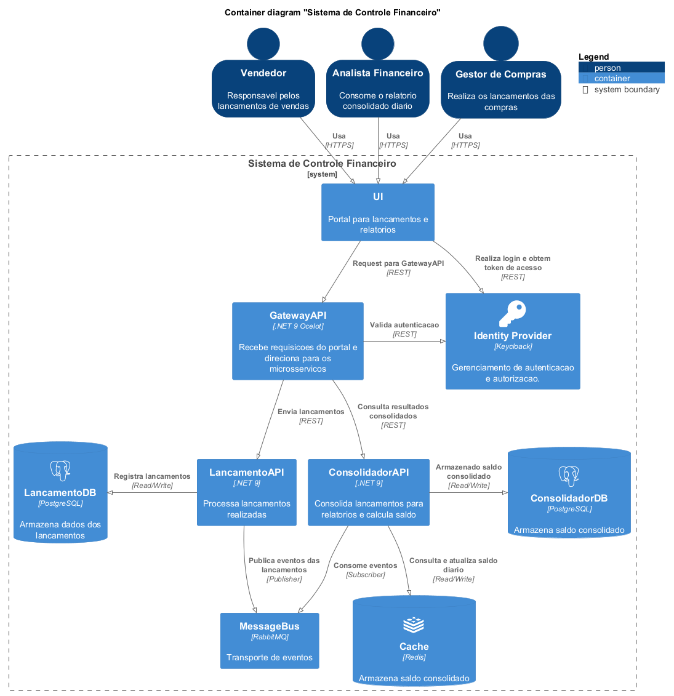

# Sistema de Controle de Financeiro

## Overview

Esse documento tem como objetivo explicar o processo de construção do sistema de controle de financeiro. Abrangendo tópicos como: objetivo do sistema, arquitetura, decisões tomadas, especifições funcionais e não funcionais.

## Contexto

Esse é um sistema com o objetivo de realizar o controle dos lançamentos de débito e credito de um comércio. E a partir desses lançamentos, gerar um relatório do consolidado diário. A fim de trazer ao comerciante, dados sobre o fechamento financeiro do dia.

## Capacidades de Negócio

- **Venda de Produtos:** Setor responsável pela realização das vendas no comércio.
- **Compra de Produtos:** Setor responsável pela realização das compras necessárias para abastecimento do comércio.
- **Gestão Financeiro:** Setor responsável pelo acompanhamento da saúde financeira do comércio.

## Domínios

- **Vendas:** Setor responsável pela realização das vendas no comércio.
- **Compras:** Setor responsável pela realização das compras necessárias para abastecimento do comércio.
- **Financeiro:** Setor responsável pelo acompanhamento da saúde financeira do comércio.

## Requisitos Funcionais

- **Cadastro de Lançamento (crédito ou débito):** O lançamentos podem ser realizados pelos times de compra ou venda. Cada lançamento tem um tipo diferente. ex: compra de um suprimento; venda de um produto. Para cada tipo de lançamento, é atribuido uma natureza, podendo ser Débito ou Crédito.

- **Consulta de Saldo Consolidado Diário:** A consulta de saldo deve retornar o resultado da soma de todos os lançamentos realizados no dia. Essa consulta pode ser extraida a qualquer momento, e deve retornar o dado quente (estado atual do saldo).

## Requisitos Não Funcionais

- **O serviço de controle de lançamento não deve ficar indisponível se o sistema
de consolidado diário cair:** O dois serviços devem funcionar de forma independente, sendo o serviço de lançamento o mais crítico, pois gera impacto operacional no comércio.

- **Em dias de picos, o serviço de consolidado diário
recebe 50 requisições por segundo, com no máximo 5% de perda de
requisições:** Considerar mudança de workload na consulta do saldo. 

## Architecture Decision Records

- [ADR: 001: Separação dos Serviços de Lançamento e Consolidação](./docs/adrs/adr-001-separacao-dos-servicos.md)
- [ADR: 002: Adicionar Camada de Comunicação entre Portal e APIs](./docs/adrs/adr-002-inclusao-de-camada-portal-api.md)
- [ADR: 003: Escolha do Sistema de Mensageria](./docs/adrs/adr-003-escolha-messagebroker.md)
- [ADR: 004: Escolha das Tecnologias dos Bancos de Dados](./docs/adrs/adr-004-escolha-bancos-de-dados.md)
- [ADR: 005: Adicionar uma Camada de Cache na Consulta de Saldo](./docs/adrs/adr-005-inclusao-cache.md)

## Desenho da Solucão

## Diagramas de Sequencia

Diagramas de sequência para cada funcionalidade do sistema.

- [Diagramas de Sequência](./docs/diagrams/v1/sequence-diagrams.md#Fluxo)

## Possibilidades de Melhoria

Melhorias que poderiam ser desenvolvidas futuramente, podendo ser consideradas como débitos técnicos.

- Controle de idempotência para garantir processamento unico das transações
- Aplicação do Pattern Outbox para aumentar resiliência em caso de insponibiliade do sistema de mensageria.

Essas melhorias, estão contempladas em uma segunda versão das documentações:
[Documentações V2](./docs/diagrams/v2/diagramsv2.md)

## Custo de Hospedagem

## Plano de Capacidade